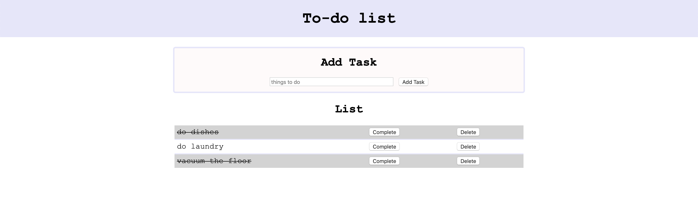

# SQL To-do list

## Description

Duration: 2 days / weekend challenge

This application allows users to organize their task using the to-do list. Built with JavaScript, jQuery, Ajax get,post,delete and put method and SQL.

- every line of code has comment of its purpose

## Usage

- When user type a new task in the input field and click 'Add Task' button, the new task will be added to the database.
- Once the new task is created, it will be displayed under list with 'Delete' and 'Complete' buttons.
- When 'Delete' button is clicked, the task will be removed from the list and the database.
- When 'Complete' button is clicked, the task will be crossed out on the frontend and complete status in the database will be updated.

## Screenshot

